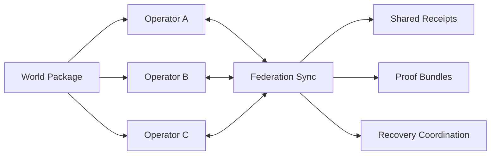

# Federation Architecture Diagram

```mermaid
flowchart LR
  WorldPackage[World Package] --> OperatorA[Operator A]
  WorldPackage --> OperatorB[Operator B]
  WorldPackage --> OperatorC[Operator C]
  OperatorA <--> Sync[Federation Sync]
  OperatorB <--> Sync
  OperatorC <--> Sync
  Sync --> Receipts[Shared Receipts]
  Sync --> Proofs[Proof Bundles]
  Sync --> Recovery[Recovery Coordination]
```
