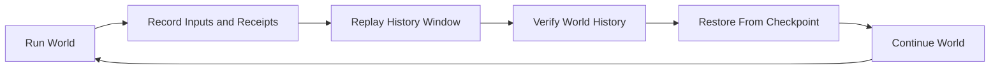

# Run → Replay → Verify → Restore → Continue

```mermaid
flowchart LR
  Run[Run World] --> Record[Record Inputs and Receipts]
  Record --> Replay[Replay History Window]
  Replay --> Verify[Verify World History]
  Verify --> Restore[Restore From Checkpoint]
  Restore --> Continue[Continue World]
  Continue --> Run
```
