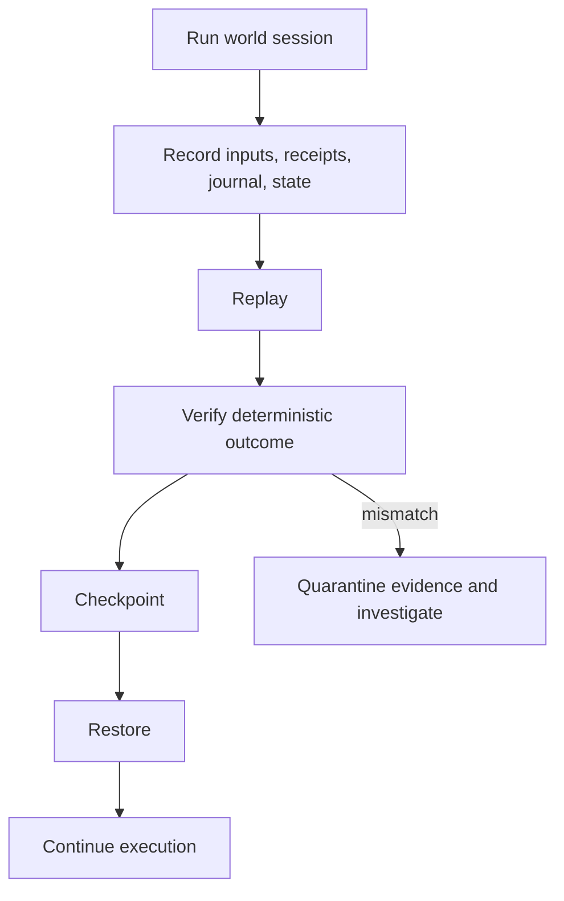

# Runtime Flow

```mermaid
flowchart TD
  Run[Run world session] --> Record[Record inputs, receipts, journal, state]
  Record --> Replay[Replay]
  Replay --> Verify[Verify deterministic outcome]
  Verify --> Checkpoint[Checkpoint]
  Checkpoint --> Restore[Restore]
  Restore --> Continue[Continue execution]
  Verify -- mismatch --> Quarantine[Quarantine evidence and investigate]
```
