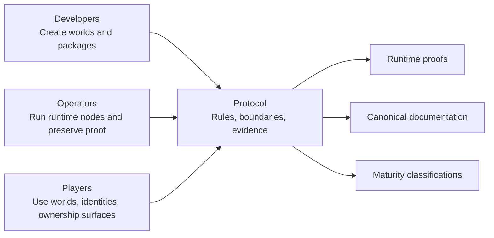

# Stakeholder Model

```mermaid
flowchart LR
  Developers[Developers\nCreate worlds and packages] --> Protocol[Protocol\nRules, boundaries, evidence]
  Operators[Operators\nRun runtime nodes and preserve proof] --> Protocol
  Players[Players\nUse worlds, identities, ownership surfaces] --> Protocol
  Protocol --> Runtime[Runtime proofs]
  Protocol --> Docs[Canonical documentation]
  Protocol --> Maturity[Maturity classifications]
```
