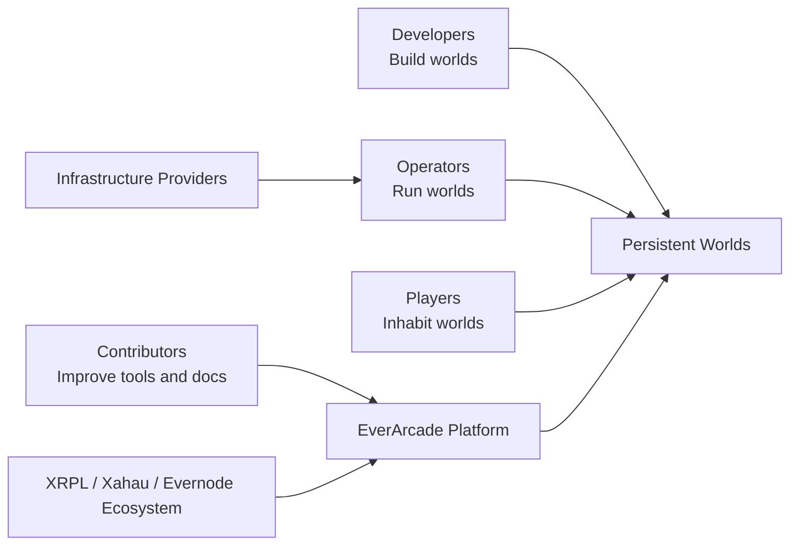

# Stakeholder Model Diagram

```mermaid
flowchart LR
  Developers[Developers\nBuild worlds] --> Worlds[Persistent Worlds]
  Operators[Operators\nRun worlds] --> Worlds
  Players[Players\nInhabit worlds] --> Worlds
  Contributors[Contributors\nImprove tools and docs] --> Platform[EverArcade Platform]
  Infra[Infrastructure Providers] --> Operators
  Ecosystem[XRPL / Xahau / Evernode Ecosystem] --> Platform
  Platform --> Worlds
```
