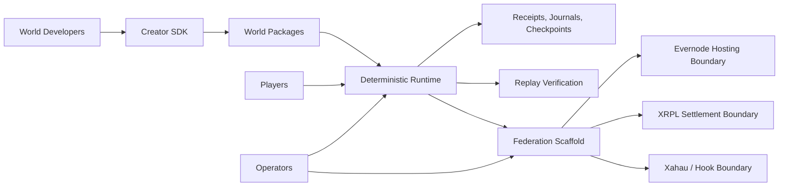

# System Overview

```mermaid
flowchart LR
  Developers[World Developers] --> CreatorSDK[Creator SDK]
  CreatorSDK --> Worlds[World Packages]
  Worlds --> Runtime[Deterministic Runtime]
  Runtime --> Receipts[Receipts, Journals, Checkpoints]
  Runtime --> Replay[Replay Verification]
  Runtime --> Federation[Federation Scaffold]
  Federation --> Evernode[Evernode Hosting Boundary]
  Federation --> XRPL[XRPL Settlement Boundary]
  Federation --> Xahau[Xahau / Hook Boundary]
  Players[Players] --> Runtime
  Operators[Operators] --> Runtime
  Operators --> Federation
```
