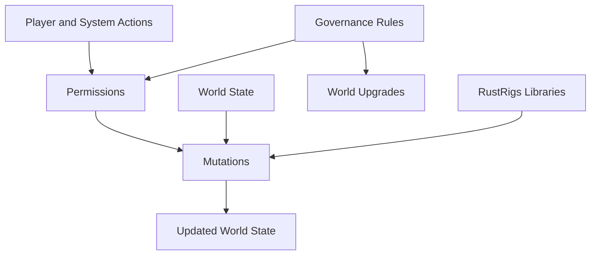

# World Contract Architecture Diagram

```mermaid
flowchart TD
  Inputs[Player and System Actions] --> Permissions
  Permissions --> Mutations
  State[World State] --> Mutations
  Mutations --> NewState[Updated World State]
  Governance[Governance Rules] --> Permissions
  Governance --> Upgrades[World Upgrades]
  RustRigs[RustRigs Libraries] --> Mutations
```
