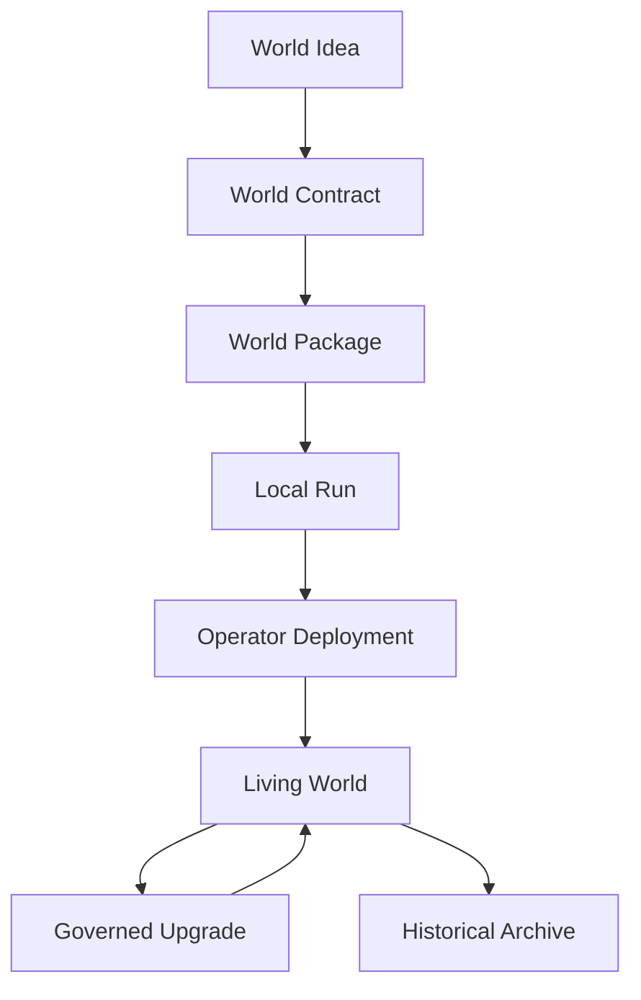

# World Lifecycle Diagram

```mermaid
flowchart TD
  Idea[World Idea] --> Contract[World Contract]
  Contract --> Package[World Package]
  Package --> Local[Local Run]
  Local --> Deploy[Operator Deployment]
  Deploy --> Live[Living World]
  Live --> Upgrade[Governed Upgrade]
  Upgrade --> Live
  Live --> Archive[Historical Archive]
```
