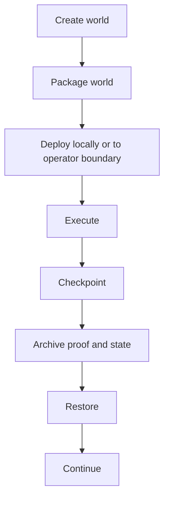

# World Lifecycle

```mermaid
flowchart TD
  Create[Create world] --> Package[Package world]
  Package --> Deploy[Deploy locally or to operator boundary]
  Deploy --> Execute[Execute]
  Execute --> Checkpoint[Checkpoint]
  Checkpoint --> Archive[Archive proof and state]
  Archive --> Restore[Restore]
  Restore --> Continue[Continue]
```
