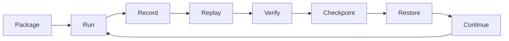

# Runtime Lifecycle

A world moves through a repeatable lifecycle: package, run, record, verify, checkpoint, restore, and continue.

The lifecycle preserves continuity while allowing operators and contributors to validate what happened.
