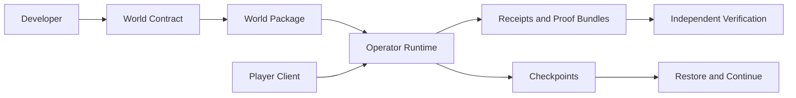

# System Overview

EverArcade separates world rules, runtime execution, operator infrastructure, player clients, and verification artifacts.

For deeper background, see the [original system architecture](./system-architecture-overview) and [runtime boundaries](./runtime-boundaries).
