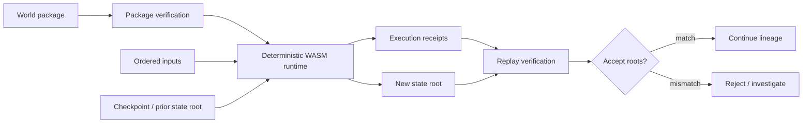

# Technical Architecture Deep Dive

EverArcade is a deterministic world runtime: it treats a game world as a replayable state machine rather than as an opaque server process. The goal is that an independent operator can take the same package, inputs, checkpoint, and protocol epoch and reproduce the same execution receipts and state roots.

> Maturity note: the local runtime, package, checkpoint, receipt, and replay path is **ALPHA**. Federation and XRPL/Xahau settlement are **SCAFFOLD**. Evernode deployment is **EXPERIMENTAL**. No subsystem is marked **PRODUCTION** in `MATURITY.md`.

## Core model

## World packages

A world package is the deployable unit. It should carry the deterministic code and metadata needed to reproduce world execution: runtime-compatible WASM, manifest data, asset and state references, canonical roots, and replay expectations. The package is not trusted because an operator hosts it; it is trusted only after canonical validation and replay evidence.

## World Contracts

World Contracts define the mutation boundary for a world. They describe which state transitions are valid, how inputs are interpreted, and which domain rules must be deterministic. Contract maturity is **EXPERIMENTAL**, so protocol engineers should treat the API surface as a developing boundary rather than a final public standard.

## Runtime packages

Runtime packages are the operator-executed artifacts that bind a world package to a runtime version and execution environment. Operators deploy them, but they do not get to redefine mutation rules, receipt calculation, or root calculation without producing divergent evidence.

## Execution receipts and state roots

Every accepted execution step should produce receipt material that can be archived and replayed. State roots summarize the resulting world state. Receipt roots summarize execution evidence. A continuity root can chain receipt and state evidence into a lineage that later operators can verify.

## Replay verification

Replay verification is the critical trust boundary. A verifier re-executes a window from a known checkpoint or genesis package, consumes the same deterministic inputs, recomputes receipts and state roots, then compares them with operator-published evidence.

## Checkpoint and restore

Checkpoints are compact restoration points. They shorten replay windows and allow crash recovery, failover, and archive restoration without discarding world history. A checkpoint must still be tied to prior receipts and lineage, otherwise it is only an opaque snapshot.

## Federation

Federation is the planned/scaffold-level path for multiple operators to coordinate around the same world evidence. In the current maturity model, federation should be described as a convergence design: nodes compare package roots, input windows, receipt roots, state roots, and archive roots. It is not a production multiplayer federation layer today.

## Operator responsibilities

Operators are responsible for hosting runtime packages, preserving inputs and receipts, producing proof bundles, maintaining checkpoints, restoring after crashes, and exposing evidence for replay. They do not own the world rules, secretly mutate state, or replace replay verification.

## XRPL/Xahau anchoring boundary

Ledger anchoring is a boundary, not the runtime itself. XRPL/Xahau evidence can reference package roots, receipt roots, state roots, continuity roots, or settlement intents, but live settlement and hooks are **SCAFFOLD**. The runtime must remain verifiable without assuming the ledger is executing the game.

## Evernode deployment boundary

Evernode deployment is **EXPERIMENTAL**. It is a hosting and lease boundary for operators, not a replacement for deterministic execution. Evernode can help place runtime workloads, while package verification, receipts, checkpoints, and replay remain the authority path.
