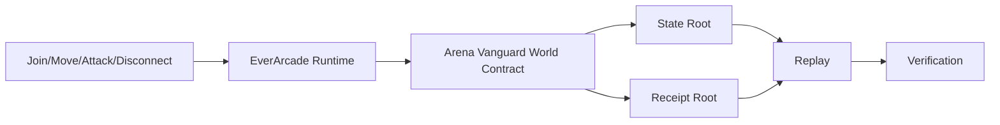

# Arena Vanguard Architecture

Arena Vanguard is the canonical first playable World Contract package. The authoritative path is deterministic runtime execution over serialized inputs; the browser projection only reads verified state.

State uses fixed tick ordering, fixed-point `i32` coordinates in centimeters, player health, combat events, and tick counters. No floating-point simulation is used.
