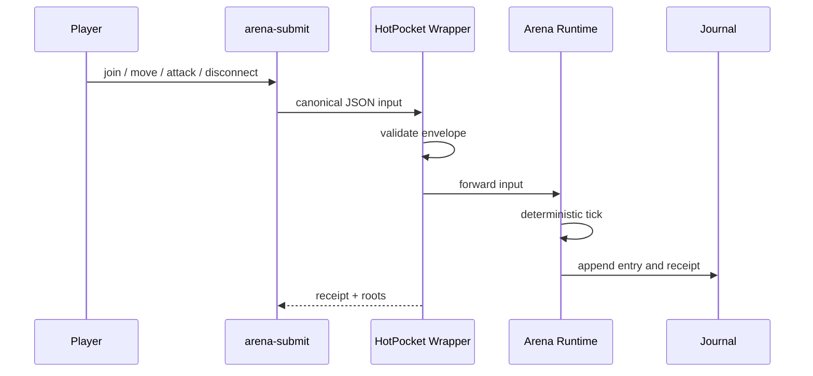

# Arena Input Flow



The live CLI supports:

```bash
arena-submit join --player player-1
arena-submit move --player player-1 --direction north
arena-submit attack --player player-1 --target player-2
arena-submit disconnect --player player-1
```

Set `ARENA_HOTPOCKET_URL` to point at a remote running contract wrapper.
