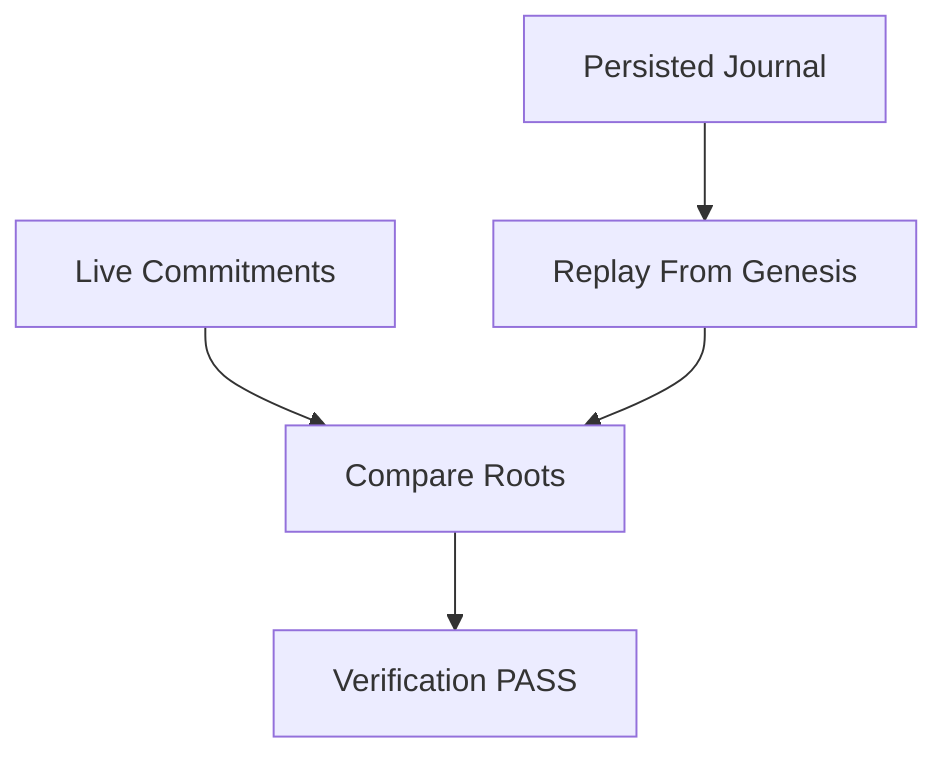

# Arena Verification Flow

Verification is automatic and deterministic:

1. Submit Join.
2. Submit Move.
3. Submit Attack.
4. Generate the persisted journal.
5. Replay the journal from genesis.
6. Compare `state_root`.
7. Compare `receipt_root`.
8. Compare `world_hash`.
9. Compare `continuity_root`.



Run:

```bash
node hotpocket-arena-wrapper/validation/verify-live-path.mjs
```
