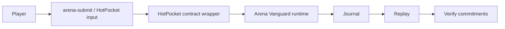

# HotPocket Contract Wrapper Architecture

`hotpocket-arena-wrapper` is a transport and persistence boundary around Arena Vanguard. It receives canonical HotPocket inputs, validates deterministic JSON envelopes, forwards accepted inputs into the Arena runtime reducer, persists the journal, and emits state commitments. The wrapper contains no gameplay-specific authority beyond input validation and calling the Arena runtime path.



## Canonical envelopes

All inputs are JSON objects serialized with sorted keys before hashing:

```json
{ "action": "join", "player": "player-1" }
{ "action": "move", "player": "player-1", "direction": "north" }
{ "action": "attack", "player": "player-1", "target": "player-2" }
{ "action": "disconnect", "player": "player-1" }
```

## Contract lifecycle

1. Start `node hotpocket-arena-wrapper/contract/index.mjs`.
2. The wrapper initializes the Arena runtime state from `evernode/hotpocket/arena-wrapper-state.json` when present.
3. HotPocket/client inputs arrive at `/input`.
4. The wrapper validates the envelope and runs exactly one deterministic tick.
5. The receipt, journal entry, and commitment tuple are persisted.
6. `/state`, `/journal`, and `/verify` expose read-only runtime outputs for projection and verification.

## Commitment tuple

Each accepted tick emits and persists:

- `state_root`
- `receipt_root`
- `world_hash`
- `continuity_root`

Replay recomputes the same tuple from the persisted journal.
