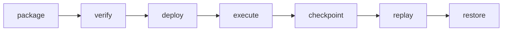
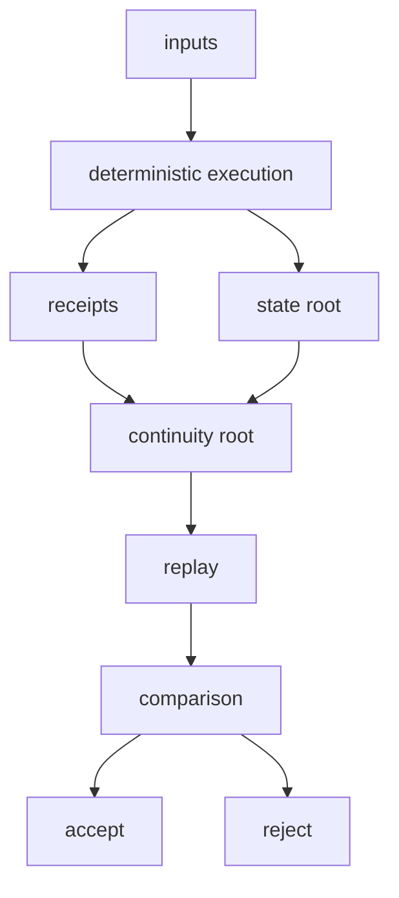

# Operator Technical Operations

This page is for infrastructure operators evaluating what EverArcade expects from a runtime host.

> Maturity note: local runtime operations are **ALPHA**. Federation is **SCAFFOLD**. Evernode deployment is **EXPERIMENTAL**. Operators should not advertise production guarantees beyond the current maturity file.

## Operator role

Operators host deterministic runtime workloads. They run verified world packages, store inputs, produce execution receipts, publish state roots, maintain checkpoints, and retain enough archives for replay.

Operators do not control world rules, player balances, canonical mutation semantics, or acceptance of divergent histories. If an operator changes execution, replay should expose a root mismatch.

## Runtime package deployment

1. Receive a world package and runtime requirement.
2. Verify canonical package roots and manifest data.
3. Bind the package to an approved runtime package.
4. Deploy the workload with deterministic configuration.
5. Start from genesis or a verified checkpoint.
6. Preserve ordered inputs and receipt output.

## Proof bundles

A proof bundle should contain the material another node needs to replay or audit a window: package identifiers, runtime version, checkpoint root, input range, execution receipts, receipt root, resulting state root, continuity root, and operator metadata.

## Deployment flow

## Verification flow

## Failure handling

### Crash recovery

Restart from the newest verified checkpoint and replay the retained input window. The recovered state root must match the pre-crash lineage expectation before service resumes.

### Checkpoint restore

Restoration loads checkpoint state, validates its root, then replays forward to the desired height. Operators should keep checkpoint metadata separate from mutable local service configuration.

### Divergent replay

A divergent replay is an incident. Stop publishing the affected lineage, preserve all inputs and receipts, compare runtime versions and package roots, and reject the branch unless the mismatch is explained by an approved protocol transition.

### Operator failover

A failover operator should receive the latest verified checkpoint, archive bundle, package root, runtime version, and input window. Failover is valid only if replay converges to the same receipt and state roots.

### Archive recovery

Archive recovery reconstructs long windows from stored inputs, checkpoints, receipts, and package metadata. Old checkpoints are useful only when they can be tied back to lineage evidence.
