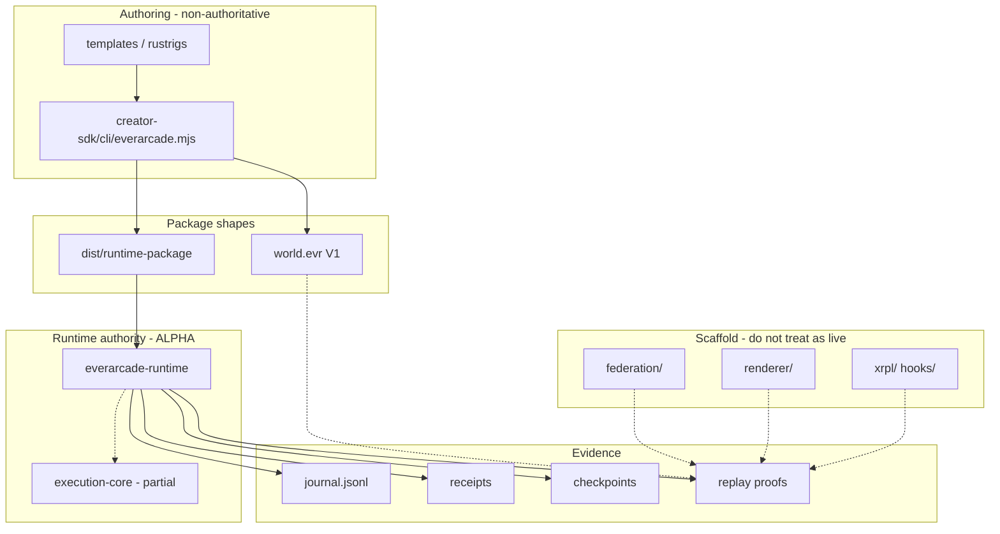

# Architecture — EverArcade Compiler

## Platform model (canonical)

From `docs/03-system-architecture.md`:

```text
Developer → Package → Runtime → Execution Core → State → Receipts → Checkpoints → Replay → (Federation) → Deployment
```

### Authority boundaries

| Component | Authoritative? | Owns |
|-----------|:------------:|------|
| Package format | Yes | code, metadata, assets, compatibility declarations |
| Runtime (`everarcade-runtime`) | Yes | lifecycle, journal, checkpoints, recovery, operator commands |
| Execution Core | Yes | deterministic execution results |
| State engine | Yes | canonical mutations and roots |
| Receipt / journal | Yes | execution evidence |
| Replay verifier | Yes | reproducibility decision |
| Federation | Partial / scaffold | peer exchange design, not live BFT network |
| Renderer | No | visual projection only |
| Creator SDK | No | prepares artifacts; does not own runtime authority |
| Deployment / Evernode | Partial / experimental | install/hosting; not production guaranteed |

v0.1 freeze (`docs/14-v0.1-architecture-freeze.md`, 2026-06-19): **single-world deterministic runtime path** is frozen. Federation, renderer, live settlement, marketplace, public hosting are **excluded**.

---

## Stack 1: Proven v0.1 path (PRIMARY — reason about this first)

### Flow

```text
creator-sdk/cli/everarcade.mjs
  → world init / build / package / verify
  → dist/runtime-package/
       manifest.json
       world.wasm
       world.json
  → runtime/everarcade-runtime (binary)
  → operator commands (boot, tick, execute-proof, replay-verify, ...)
  → evidence/
       journals/journal.jsonl
       receipts/receipt-*.json
       checkpoints/checkpoint-*.json
       reports/*-proof.json
```

### Key implementation files

| Concern | Path |
|---------|------|
| Runtime entry | `runtime/everarcade-runtime/src/main.rs` |
| Boot / tick loop | `runtime/everarcade-runtime/src/runtime/runtime_loop.rs` |
| Package load | `runtime/everarcade-runtime/src/runtime/package_loader.rs` |
| Journal | `runtime/everarcade-runtime/src/runtime/journal.rs` |
| Checkpoints | `runtime/everarcade-runtime/src/runtime/checkpoints.rs` |
| Replay | `runtime/everarcade-runtime/src/runtime/replay.rs` |
| Guest WASM | `runtime/everarcade-runtime/src/runtime/guest_wasm.rs` |
| Operator CLI | `runtime/everarcade-runtime/src/runtime/operator.rs` |
| Creator CLI | `creator-sdk/cli/everarcade.mjs` |
| Canonical roots (cert) | `crates/canonicalizer-kernel/src/lib.rs` |

### Execution modes inside runtime

Package `world.json` `package_classification` selects path:

| Classification | Behavior |
|----------------|----------|
| `placeholder` | `execute_tick` — rolling SHA256 hash chain over inputs |
| `official-template` | In-process `ArenaState` gameplay (join/move/attack/score) |
| `wasm-guest` | wasmtime `everarcade_guest_execute` via `guest_wasm.rs` |

**Nuance:** default tick path is simplified (hash chain), not full game re-execution. Template and guest paths do fuller replay.

---

## Stack 2: Civilization / host path (SECONDARY — scaffold-heavy)

### Flow

```text
CivilizationPackage (bincode)
  → everarcade-host/package_loader.rs
  → execution_core::vm::execute_vm_boundary (hash-chained VM receipt)
  → receipt_store + checkpoint_store + anchor_queue
  → XRPL/Evernode anchor intents (scaffold)
```

### Key files

| Concern | Path |
|---------|------|
| Host runner | `everarcade-host/src/runner.rs` |
| Package decode | `everarcade-host/src/package_loader.rs` (fixture fallback on decode fail) |
| VM boundary | `execution-core/src/vm/vm_execution.rs` |
| Federation scaffold | `everarcade-host/src/federation_network/`, `everarcade-host/src/network/` |

**Not the same binary as `everarcade-runtime`.** Different package format.

---

## execution-core/ — deep library, uneven integration

- **~1,900 files**, largest first-party Rust surface
- WASM engine via wasmtime (`execution-core/src/wasm/`)
- State engine, merkle, checkpoint models
- 100+ modules including federation simulation, XRPL, civilization, economics
- Crate header warns many modules are prototype/certification, not production-wired
- `execute::execute_vm` may apply **empty** state changes in some paths
- Federation **simulation tests** are real (`execution-core/tests/federation_simulation_tests.rs`); `federation/` directory is mostly shell model

---

## Package formats (TWO SHAPES — common confusion)

| Format | Produced by | Consumed by | Purpose |
|--------|-------------|-------------|---------|
| `dist/runtime-package/` | Creator SDK `packageGame()` | `everarcade-runtime` | Runnable local appliance |
| `out/world.evr` / V1 factory | Creator SDK factory flow | Certification, operators, specs | Rich genesis, hash-manifest, attestation |

Specs: `specs/world-evr-package/WORLD_EVR_PACKAGE_SPEC_V1.md`, `CANONICAL_PACKAGE_FORMAT.md`.

Reference demo: `examples/reference-certified-world-v1/` (build `world.evr`, verify certification).

**Gap:** Creator SDK README admits not all paths bridge SDK output to runtime appliance format.

---

## Canonicalizer kernel vs runtime hashing

- `crates/canonicalizer-kernel/` — deterministic `ArenaState` → canonical JSON → SHA256 roots (certification-grade)
- Runtime `runtime_loop.rs` uses its own `ArenaState` + `serde_json` hash
- **Not fully unified** — certification roots may differ from appliance runtime roots

---

## compiler/ — meta tooling, NOT game compiler

- `compiler/agent/agent_v8.py` — Python agent scaffolds repo files
- `compiler/kernel/` — IR, DAG, plan executor
- Does **not** compile worlds to WASM; generates `execution-core` structure

---

## Workspace CLI glue

- `src-bin-everarcade/` — Rust CLI with `package-game`, `replay-world`, many `runtime-*-status` commands
- Many `developer_command` handlers return **deterministic JSON stubs**, not live runtime calls

---

## External boundaries

| Surface | Location |
|---------|----------|
| Public docs site | `everarcade-frontend` / `docs.everarcade.games` |
| Vision site | `vision.everarcade.games` |
| Migration bundle | `public-surface-export/` |
| In-repo frontend | `frontend/` — prototype; `arena-live-client` is most functional |

---

## Data flow diagram (agent reference)

