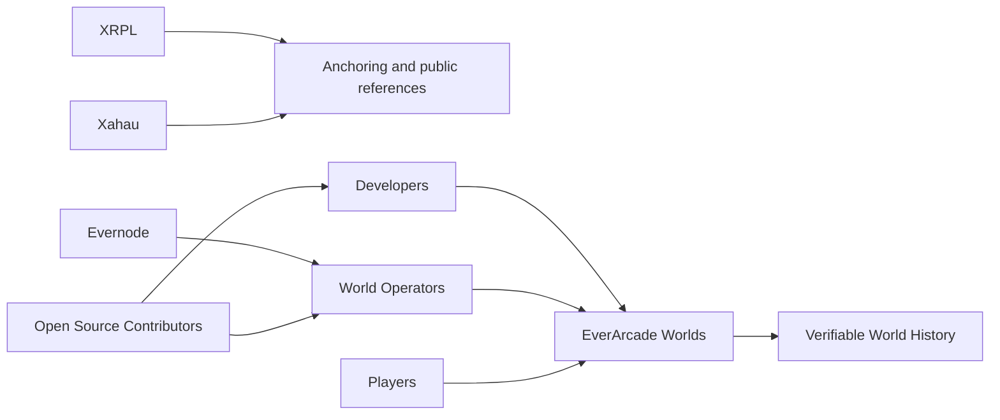

# Community

EverArcade is an ecosystem effort. Worlds become stronger when developers, operators, players, and open source contributors can coordinate around shared continuity.

## Ecosystem relationships

- **XRPL** provides a broader ledger ecosystem for public references and ownership-adjacent workflows.
- **Xahau** expands the surrounding smart contract and ledger conversation.
- **Evernode** informs decentralized hosting and operator participation patterns.
- **World Operators** keep worlds online, recoverable, and independently checkable.
- **Developers** create worlds, rules, templates, and tools.
- **Players** give worlds life through culture, trade, conflict, and memory.
- **Open Source Contributors** improve the runtime, documentation, SDKs, and launch readiness.

## Join the work

- [Founding Developers](/founding-developers)
- [Operators](/operators)
- [GitHub](https://github.com/everarcade/everarcade-compiler)
